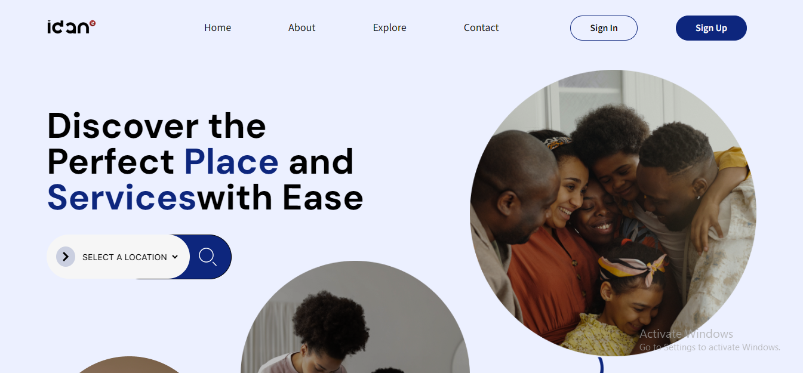
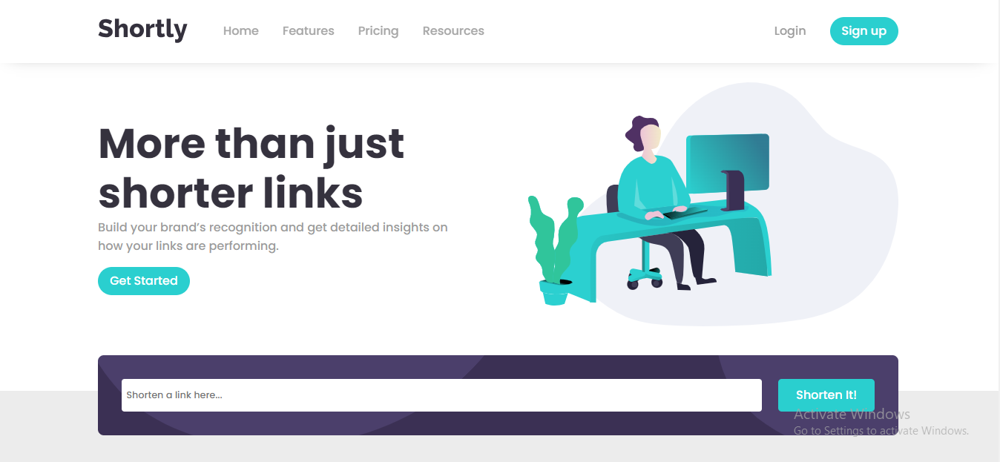
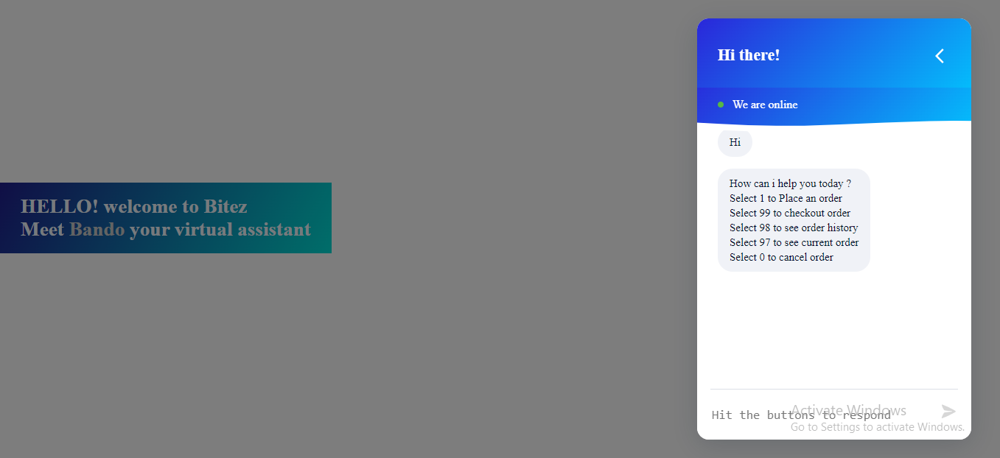
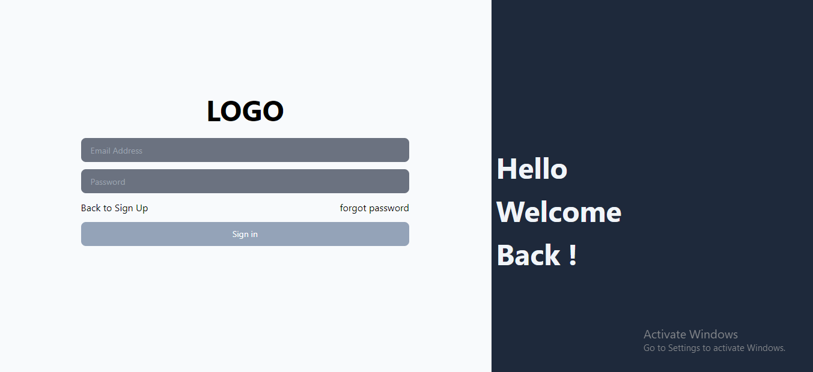
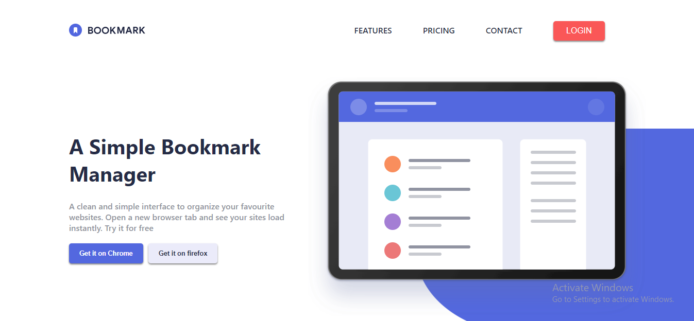

## Property Centre
A web application to search for your preferred hotels and services
- 
- Tags: Category 1
- Badges:
  - typescript | express | postgressql | nodemailer | redis [blue]
- Buttons:
  - live [https://propertycentre-testing.vercel.app]
  - Github [https://github.com/Horlawhumy-dev/propertycentre-backend/tree/main]

## shortly
Shortly is a powerful link shortner app that allows you to quickly and securely shorten your long URLs
- 
- Tags: Category 1
- Badges:
  - nestjs | typeorm | mongoDB  [blue]
- Buttons:
  - live [https://scissors-shortner.netlify.app]
  - Github [https://github.com/ademesojosiah/Linkr]

## Bando chatBot
A restaurant chatBot
- 
- Tags: Category 1
- Badges:
  - express | socket.io | cookie | mongoDB [blue]
- Buttons:
  - live [https://bando.onrender.com/]
  - Github [https://github.com/ademesojosiah/Meet-bando]

## Circle-7 API
A social media App  for developers to interact and socialize
- 
- Tags: Category 1
- Badges:
  - nodejs | express |sequelize | nodemailer | MySQL  [blue]
- Buttons:
  - Live [https://test-social.vercel.app/login]
  - Github [https://github.com/Cirle-7/social-media-app]
  
## Landing Page
A landing page built with react
- 
- Tags: Category 1
- Badges:
  - reactjs | netlify  [blue]
- Buttons:
  - Live [https://landdingpagee.netlify.app]
  - Github [https://github.com/ademesojosiah/landing-page]

